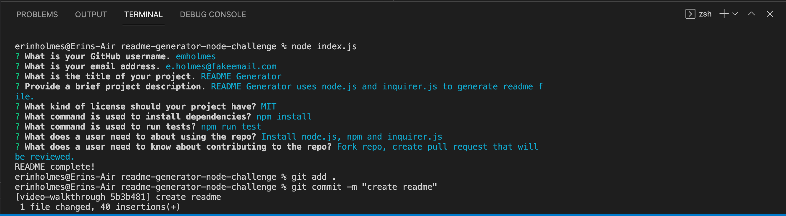

# Professional README Generator 
## Node.js Challenge

## Description
This repo contains the code to generate a README file using node.js and command-line prompts via Inquirer.js. This repository uses Node.js, npm, inquirer.js, and markdown. View the installation and usage sections below for more details on how to use this repo.

## Table of Contents
* [Installation](#installation)
* [Usage](#usage)
* [Contributing](#contributing)
* [Video Walkthrough](#video-walkthrough)
* [Questions](#questions)
  
## Installation
To install any necessay dependencies run the following command: 

    npm install

## Usage
After you clone the repo to your local machine, open the package up in your favorite IDE. Make sure npm is installed (hint: `npm -v`). From within your local package’s root directory install inquirer.js, `npm install inquirer`. This will install all inquirer dependencies. Once inquirer is installed, execute the program by running `node index.js` in the terminal. You will be prompted with some questions about the project for the README being generated. Once all questions are answered, a README.md is generated in the root directory.  

## Video Walkthrough 
[Video walkthrough](https://drive.google.com/file/d/1C93Apu6RfJPSAJdn-KKaQ2Ckb8MRg0f4/view)

View README generated in this video view the [video-walkthrough branch](https://github.com/emholmes/readme-generator-nodejs/tree/video-walkthrough).

Invoking application in the terminal:

README Generated in Video Walkthrough:

## Questions
If you have any questions or feedback about the repo, create a new issue and add the label "question”.
View more of my work on GitHub: [emholmes](https://github.com/emholmes).